class: middle, center, title-slide
count: false

# Contributions to Multi-Agent Reinforcement Learning

PhD Defense

  

Pascal Leroy 
June 28, 2024

---
# Today
  

- Introduction to reinforcement learning.

- Multi-agent reinforcement learning.

- Contributions of the thesis:
    - Learning to cooperate,
    - Learning to cooperate in a competitive environment.

???

Today, I will try to explain what is reinforcement learning.

In the first part, we will start with the classical setting where a single agent learns with reinforcement learning.

Then, we will discuss what changes when several agents learn.

In the second part of the presentation, we will dive more technically in the contributions of the thesis and what is to learn to cooperate and how to cooperate in a competitive environment.

---

class: section

# Reinforcement learning

---
class: middle

.italic[Reinforcement learning is learning what to do, how to map situations to .bold[actions], so as to .bold[maximize] a numerical .bold[reward] signal.]

.pull-right[Sutton & Barto, 1998.]  

.center[.circle.width-25[]
.circle.width-25[]]

---
class: middle

.center[
<video controls preload="auto" height="500" width="700">
  <source src="./figures/chicken1.mp4" type="video/mp4">
</video>]

.footnote[Video credits: [Megan Hayes](https://twitter.com/PigMegan), [@YAWScience](https://twitter.com/YAWScience/status/1304199719036444672), 2020. Taken from [Intro to IA](https://github.com/glouppe/info8006-introduction-to-ai/) by Gilles Louppe.]

???

To provide some intuitions, let us watch this video of a chicken trained to pick the pink paper.

The chicken has to perform the correct actions to obtain the reward, which is to pick de pink paper.

Everytime, its environment changes!

The pink paper is moved to another place and the chicken needs to adapt to the changes in the state of its environment to obtain the reward.

---
class: middle

.center[
<video controls preload="auto" height="500" width="700">
  <source src="./figures/chicken2.mp4" type="video/mp4">
</video>]

.footnote[Video credits: [Megan Hayes](https://twitter.com/PigMegan), [@YAWScience](https://twitter.com/YAWScience/status/1304199719036444672), 2020. Taken from [Intro to IA](https://github.com/glouppe/info8006-introduction-to-ai/) by Gilles Louppe.]

???

Let us look at another example with a cone.

The chicken has to circle around it to receive a reward.

You see here, it understands that the reward is in the hand.

But it has to figure out that it needs to circle around the cone!

And even if it succeeded before, it can still fail because it is still exploring what is the best things to do.

---

class: middle

An agent is learning by .bold[interacting] in its .bold[environment] to maximise a reward.

 

.center[.width-100[]]

.footnote[R. S. Sutton and A. G. Barto. Reinforcement learning, second edition: An introduction. 2018]

???

.bold[DIRE S U et R]

To rephrase our first definition, we then say that in RL, an agent is learning by interacting in its environment to maximise a reward.

As we can see in the diagram, the environment is in a given state, given by the letter S.

The agent perceives this state and decide on an action, that we denote U.

It then receives a reward R and start over.

---

# Chicken environment

.grid[
.kol-1-3[
.center[States $s$

Chicken location $(x, y)$]
]
.kol-2-3[
.center[.width-100[]]
]]

???
Let's look and example

---

# Chicken environment

.grid[
.kol-1-3[
.center[Actions $u$

$[Left, Right, Up, Down]$]
]
.kol-2-3[
.center[.width-100[]]
]]

---

# Chicken environment

.grid[
.kol-1-3[
.center[
Transition function

$s_{t+1} = P(s_t, u_t)$
]
]
.kol-2-3[
.center[.width-100[]]
]]

---

# Chicken environment

.grid[
.kol-1-3[
.center[
Reward function

$+1$ if $s = (4,4)$, 

$-1$ if $s = (2, 4)$,

$0$ otherwise
]
]
.kol-2-3[
.center[.width-100[]]
]]

---

# The optimal policy

.center[For each $s=(x, y)$, we want to choose the .bold[best action!]]

.center[.width-80[]]

???
Let's think for a second, what is the best action to be made in (3,4) or in (3, 1)?

---

class: middle

Easy to find the optimal policy, why do we need reinforcement learning?

.center[.width-80[]]

---
# What knows the agent?

1. It is in the state (1, 1),

2. It has the choice between four actions.

--

It does not know:

- What means (1, 1),

--

- The third action is "Up",

--

- Taking the third action will change the state to (2, 1),

--

- The reward in (2, 1) is 0.

--

It needs to .bold[explore], by trials and errors, to learn the optimal policy.

---
# Examples of RL application

- Content recommendation
- Chip design
- Drone control
- Robotics

???
Provide state and action and reward intuitions.

---
# Wrap-up

- In RL, an agent learns by interacting in its environment to maximise a reward.

- It learns a policy that provides the action $u$ to take in a state $s$.

- It does not know the environment and needs to explore.

--

# What if the fox can move?

---
class: section

# Multi-Agent

# Reinforcement Learning

???
What changes if the fox can move and also learn?

---

# Multi-agent environment

All agents $a\_i \in \{ 1,...,n \}$ learn a policy $\pi^{a}$ to maximise their own reward $r_t^{a\_i}$.

.center[.width-100[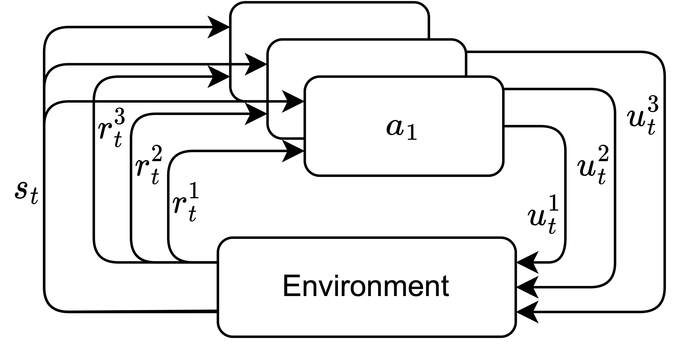]]

???
We still have the transition

---
class: middle

# **.bold[Rewards depend on actions of all agents]**

---

# Different goals

1. .bold[Cooperation]

--

2. .bold[Competition]

--

3. .bold[General sum]

---
class: section

# Learning with reinforcement learning

---

# Goal

The agent learns the policy $\pi$ mapping a state $s$ to an action $u$ that maximises

$$\mathbb{E}_{\pi} \left[ \sum_t \gamma^t r_t \right].$$

The discount factor $\gamma \in [0, 1]$ encourages direct reward.

???
How can I know which is the best action?

---

# In practice

Transition function defines a probability to reach $s\_{t+1} \sim P(s\_{t+1}|s\_t, u\_t)$.

--

.bold[Markov Decision Process (MDP).]

.center[.width-100[]]

???
Talk about the markov property.

---

# Policy evaluation

What is the expected sum of discounted rewards from $s$ following $\pi$?

--

This is the .bold[state value function] $V$.

$$ V^{\pi}(s)= \mathbb{E}_{\pi} \left[ \sum_t \gamma^t r_t \right]$$ 

--

$$ V^{\pi}(s)= \mathbb{E}\_{\pi}\left[r\_t + \gamma V^{\pi}(s\_{t+1})|s\_t=s\right]$$

--

The .bold[optimal policy] is

$$ \pi^\*(s) = \arg\max\_\pi V^{\pi}(s).$$

---

# The state-action value function

From $s$, taking $u$, what is the expected sum of discounted reward following $\pi$?

--

$$ Q^\pi(s\_t, u\_t) = \mathbb{E}\_{\pi}\left[r\_t + \gamma V^{\pi}(s\_{t+1})|s\_t=s, u\_t = u\right]$$

--

Allows the deterministic policy 

$$ \pi(s) = \arg\max\_u Q^\pi (s, u) $$

--

Bellman optimality equation

$$ Q^{\pi^\*}(s, u) = \max\_{\pi}Q^\pi(s, u) $$

--

$$  Q^{\pi^\*}(s, u) = \mathbb{E}\_{\pi^\*}[r\_t + \gamma \max\_{u'} Q^{\pi^\*}(s\_{t+1}, u') |s\_t=s, u\_t=u]$$

---

# Q Learning

If we know the optimal Q values, we know the optimal policy.

$$ \pi^\*(s) = \arg\max\_u Q^{\pi^\*} (s, u) $$

--

- Play and update:

$$ \widehat{Q}(s\_t, u\_t) \leftarrow \widehat{Q}(s\_t, u\_t) + \alpha \left[ r\_t + \gamma \max\_u \widehat{Q}(s\_{t+1}, u) - \widehat{Q}(s\_t, u\_t) \right]$$

- Learning rate $\alpha \in [0, 1].$ 

---

# Deep Q Network (DQN)

Q-learning with a neural network $\theta$.

Minimise the loss

$$
\mathcal{L}(\theta) = \mathbb{E}\_{\langle s\_{t},u\_{t},r\_{t},s\_{t+1} \rangle \sim B} \big(r\_{t} + \gamma  \underset{u \in \mathcal{U}}{\max} Q(s\_{t+1}, u; \theta') - Q(s\_{t}, u\_{t}; \theta)\big)^2$$

- The replay buffer $B$ is a collection of transitions,
- $\theta'$ is the target network,
- Transitions with $\epsilon$-greedy policy.

--

If $s$ are images, $\theta$ is a CNN.

If $s$ is partially obserable, $\theta$ is a RNN.

???
- The replay buffer $B$ is a collection of transitions.
- Sampling transitions allows to update the network.
- $\theta'$ are the parameters of the target network, a copy of $\theta$ periodically updated.
- To play Atari games:
    - $\theta$ is a CNN.
- When the environment is partially observable (POMDP):
    - $\theta$ is a recurrent network (DRQN).
    - $B$ stores sequences of transitions.

---
class: section

# Learning to cooperate with reinforcement learning

???

- Train a team to cooperate
- Contributions

---
# Decentralised Partially Observable Markov Decision Process (Dec-POMDP)

A single global reward

$$
r^{a\_1}\_t = r^{a\_n}\_t=r\_t = R(s\_{t+1}, s\_t, \mathbf{u\_t}): \mathcal{S}^2 \times \mathcal{U} \rightarrow \mathbb{R}
$$

.center.width-85[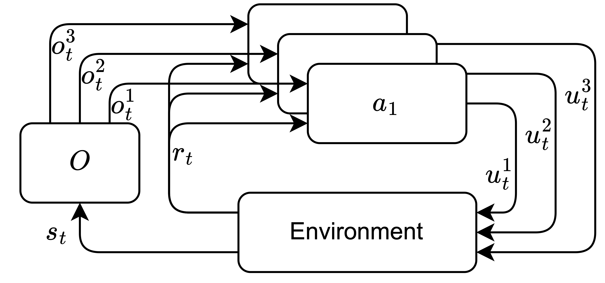]

---
class: middle

# Robotic warehouses

Slow down animation

.center.width-85[]

.footnote[Add citation]

---
class: middle

# Multi-Agent Tracking

.center.width-65[]

.footnote[Add citation]

---
class: middle

# StarCraft Multi-Agent Challenge

Cooperation because opponents does not learn!

<iframe width="450" height="300" src="https://www.youtube.com/embed/VZ7zmQ_obZ0" title="SMAC: The StarCraft Multi-Agent Challenge" frameborder="0" allow="accelerometer; autoplay; clipboard-write; encrypted-media; gyroscope; picture-in-picture; web-share" allowfullscreen></iframe>

.footnote[https://github.com/oxwhirl/smac  Samvelyan, M., Rashid, T., De Witt, C. S., Farquhar, G., Nardelli, N., Rudner, T. G., ...  Whiteson, S. (2019). The starcraft multi-agent challenge.]

???
We do not play Starcraft!

More details on the setting

---
class: middle

# StarCraft Multi-Agent Challenge

3M

.center.width-75[]

3S5Z

.center.width-75[]

.footnote[https://github.com/oxwhirl/smac  Samvelyan, M., Rashid, T., De Witt, C. S., Farquhar, G., Nardelli, N., Rudner, T. G., ...  Whiteson, S. (2019). The starcraft multi-agent challenge.]

---
# Centralised controller

--

.grid[
.kol-2-5[
- Learn $Q(s\_t, \mathbf{u\_t})$.

.bold[Problems:]

- $|\mathcal{U}\_1 \times ... \times \mathcal{U}\_n|$.

- Partial observability?

]
.kol-3-5[
.center.width-100[]
]
]

---

#  Decentralised controller

.grid[
.kol-2-5[
- Independent Q-Learning: learn $Q\_a(\tau^a\_t, u^a\_t)$

.bold[Problems:]

- Non-stationarity

- Credit assessment

]
.kol-3-5[
.center.width-100[]
]
]

---

# Centralised training with   decentralised execution (CTDE)

It is possible to learn $Q(s\_t, \mathbf{u\_t})$ during training.

- Training in simulator.

- We know $s$ at training.

- We have access to all actions.

---

# CTDE Value-based methods

Only $Q\_a(\tau^a\_t, u^a\_t)$ during the execution.

--

.bold[GOAL]: $\underset{u^a_t}{\arg\max} Q\_a(\tau^a\_t, u^a\_t)$ maximises $Q(s\_t, \mathbf{u\_t})$.

--

.bold[Solution]: Learn $Q(s\_t, \mathbf{u\_t})$ as a factorisation of all $Q\_a(\tau^a\_t, u^a\_t)$ .

---

# Individual Global Max

Learn $Q(s\_t, \mathbf{u\_t})$ as a function of all $Q\_a(\tau^a\_t, u^a\_t)$ during training.

$$
\underset{\mathbf{u\_t}}{\arg\max} Q(s\_t, \mathbf{u\_t}) 
=
\begin{pmatrix}
\underset{u^{a\_1}\_t}{\arg\max} Q\_1(\tau^{a\_1}\_t, u^{a\_1}\_t)\\\\
.\\\\
.\\\\
.\\\\
\underset{u^{a\_n}\_t}{\arg\max} Q\_n(\tau^{a\_n}\_t, u^{a\_n}\_t) 
\end{pmatrix}
$$

--

Value Decomposition Network (VDN)

$$
    Q(s\_t, \mathbf{u\_t}) = \sum\_{i=1}^n Q\_{a\_i}(\tau^{a\_i}\_t, u^{a\_i}\_t) 
$$

--

The optimisation procedure follows the Deep Q Network algorithm
$$
    \mathcal{L}(\theta) = \mathbb{E}\_{ \langle . \rangle \sim B }
    \bigg[  \big(r\_{t} + \gamma \underset{\mathbf{u} \in \mathcal{U}}{\max} Q(s\_{t+1}, \mathbf{u}; \theta') - Q(s\_{t}, \mathbf{u\_{t}}; \theta)\big)^{2} \bigg]
$$

???

$Q_a$ is not a $Q$ function anymore, but a utility function used to select actions.

 

Question: How to satisfy IGM?

---
# QMIX

We want non-linear factorisation of $Q(s\_t, \mathbf{u\_t})$!

.footnote[Rashid, T., Samvelyan, M., Schroeder, C., Farquhar, G., Foerster, J., Whiteson, S. (2018). Qmix: Monotonic value function factorisation for deep multi-agent reinforcement learning.]

--

$$
    \frac{\partial Q(s\_t, \mathbf{u\_t})}{\partial Q\_{a}(\tau^{a}\_t, u\_t^{a})} \geq 0 \text{ } \forall a \in \{a\_1,..,a\_n\}
$$

--

.center.width-50[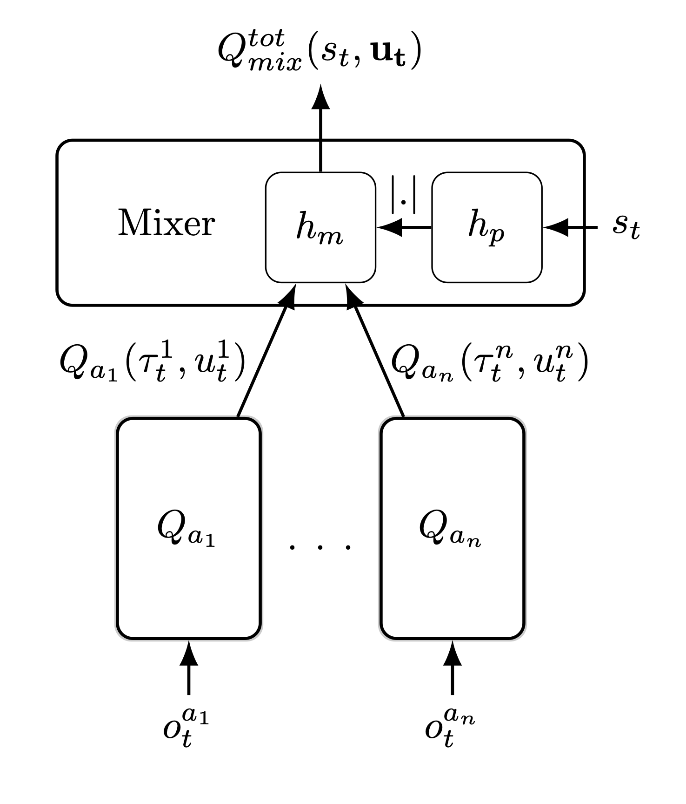]

---
class: middle

Are there better methods than Deep Q Network?

---
# Deep Quality-Value

Deep Q Network:
$$
    \mathcal{L}(\theta) = \mathbb{E}\_{\langle s\_{t},u\_{t},r\_{t},s\_{t+1}\rangle \sim B}
    \bigg[ \big(r\_{t} + \gamma \max\_{u \in \mathcal{U}} Q(s\_{t+1}, u; \theta') - Q(s\_{t}, u\_{t}; \theta)\big)^{2}\bigg]
$$

Motivation:

$$ V(s\_{t+1}) =\max\_{u} Q(s\_{t+1}, u; \theta')$$

---
# Deep Quality-Value

Learn $Q(.;\theta)$ and $V(.;\phi)$ at the same time.

$$
\mathcal{L}(\theta) = \mathbb{E}\_{\langle s\_t,u\_t,r\_t,s\_{t+1}\rangle\sim B} \bigg[ \big(r\_t + \gamma V(s\_{t+1}; \phi') - Q(s\_t, u\_t; \theta) \big)^{2} \bigg]
$$
$$
\mathcal{L}(\phi) = \mathbb{E}\_{\langle  s\_{t},u\_{t},r\_{t},s\_{t+1}  \rangle\sim B} \bigg[\big(r\_{t} + \gamma V(s\_{t+1}; \phi') - V(s\_{t}; \phi)\big)^{2}\bigg]
$$

--

Benefit :
- Reduce the overestimation problem of DQN.

.footnote[M. Sabatelli, G. Louppe, P. Geurts, and M. A. Wiering. Deep quality-value (DQV)
learning. 2018]

---
class: middle

# Contribution:

# Extending the Deep Quality-Value Family of Algorithms to Cooperative Multi-Agent Reinforcement Learning.

---
# QVMix

Take the architecture of $Q$ in QMIX to compute both $Q$ and $V$. 

--

.bold[QVMix:]

$$
    \mathcal{L}(\theta) = \mathbb{E}\_{\langle . \rangle \sim B}
    \bigg[\big(r\_{t} + \gamma V(s\_{t+1}; \phi') - Q(s\_{t}, \mathbf{u\_{t}}; \theta)\big)^{2}\bigg]
$$
$$
    \mathcal{L}(\phi) = \mathbb{E}\_{\langle . \rangle\sim B} 
    \bigg[\big(r\_{t} + \gamma V(s\_{t+1}; \phi') - V(s\_{t}; \phi)\big)^{2}\bigg]
$$

<!-- 
.bold[QVMix-Max:]

$$
    \mathcal{L}(\phi) = \mathbb{E}\_{\langle . \rangle\sim B} 
    \bigg[\big(r\_{t} + \gamma \max\_{\mathbf{u} \in \mathcal{U}} Q(s\_{t+1}, \mathbf{u}; \theta') - V(s\_{t}; \phi)\big)^{2}\bigg]
$$
 -->

---
#QVMix results

.grid[

.kol-1-2[
.center.width-100[3M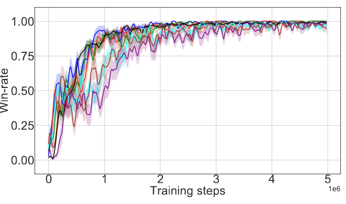]
]
.kol-1-2[
.center.width-100[3S5Z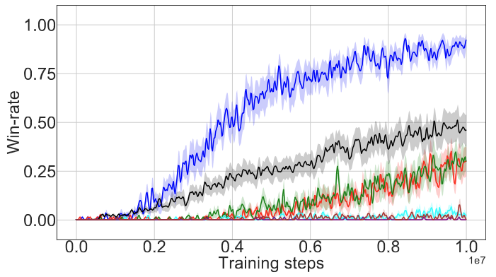]
]]
.center.width-100[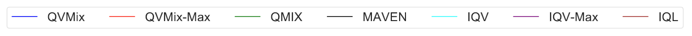]

.footnote[Leroy, P., Ernst, D., Geurts, P., Louppe, G., Pisane, J.,  Sabatelli, M. (2020). QVMix and QVMix-Max: Extending the Deep Quality-Value Family of Algorithms to Cooperative Multi-Agent Reinforcement Learning.]

---
# QVMix overestimation bias

.center.width-90[]
.center.width-100[]

.footnote[Leroy, P., Ernst, D., Geurts, P., Louppe, G., Pisane, J.,  Sabatelli, M. (2020). QVMix and QVMix-Max: Extending the Deep Quality-Value Family of Algorithms to Cooperative Multi-Agent Reinforcement Learning.]

---

# QVMix and QVMix-Max

- Learning $V$ as a target for learning $Q$.

- New value based methods for Dec-POMDP:
    - Indepent learner: IQV and IQV-Max
    - CTDE: QVMix and QVMix-Max

- Achieve similar and sometimes better performance than QMIX.

- Reduce the overestimation bias.

---
class: section

# Contribution

# IMP-MARL: a Suite of Environments for Large-scale Infrastructure Management Planning via MARL

---

# Infrastructure management planning

- Maintain a system composed of different parts.
    - Bridges
    - Wind farms

--

- .bold[TASK:] Decide which component needs to be inspected or repaired.

--

- .bold[GOAL:] Reduce maintenance cost and failure risks.

--

- .bold[CONTRIBUTION:]
    - Today, solved with expert-based heuristic.
    - Can (MA)RL solve this problem?
    - Do CTDE methods scale well?

---
class: middle

.center.width-100[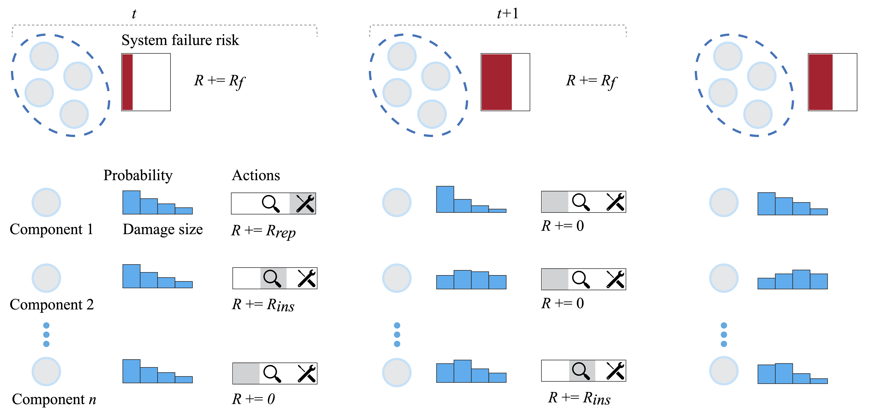]

.footnote[
P Leroy, PG Morato, J Pisane, A Kolios, D Ernst. IMP-MARL: a suite of environments for large-scale infrastructure management planning via MARL. 2023 
]

???

- State and observations:
    - Probability on the deterioration state of each part.

- Actions: 

    1. Do-nothing
    2. Inspect
    3. Replace/repair

- Maximise the reward:

$$ \sum\_{t=0}^{T-1} \gamma^t \left[ R\_{t,f}+ \sum\_{a=1}^n \left({R\_{t,ins}^a} + {R\_{t,rep}^a}\right) \right]$$

- Failure cost is $R\_f = c\_F \times p\_{Fsys}$.

encompassing economic, environmental, and societal losses

---
# A k-out-of-n system

- Fail if less than 4-out-of-5 components work.

- In our work, simulated deterioration of a crack size.

- No correlation between parts.

.width-100[]

.footnote[
P Leroy, PG Morato, J Pisane, A Kolios, D Ernst. IMP-MARL: a suite of environments for large-scale infrastructure management planning via MARL. 2023 
]

---

# How to solve with (MA)RL?

- One agent decide for one part of the system.

- They all cooperate to maximise the reward.

$$ \sum\_{t=0}^{T-1} \gamma^t \left[ R\_{t,f}+ \sum\_{a=1}^n \left({R\_{t,ins}^a} + {R\_{t,rep}^a}\right)  \right]$$

- .bold[GOAL]: Can (MA)RL be better than the heuristic?

---

# How better than the heuristic?

Normalised boxplot against the expert rule-based heuristic policy.

.center.width-60[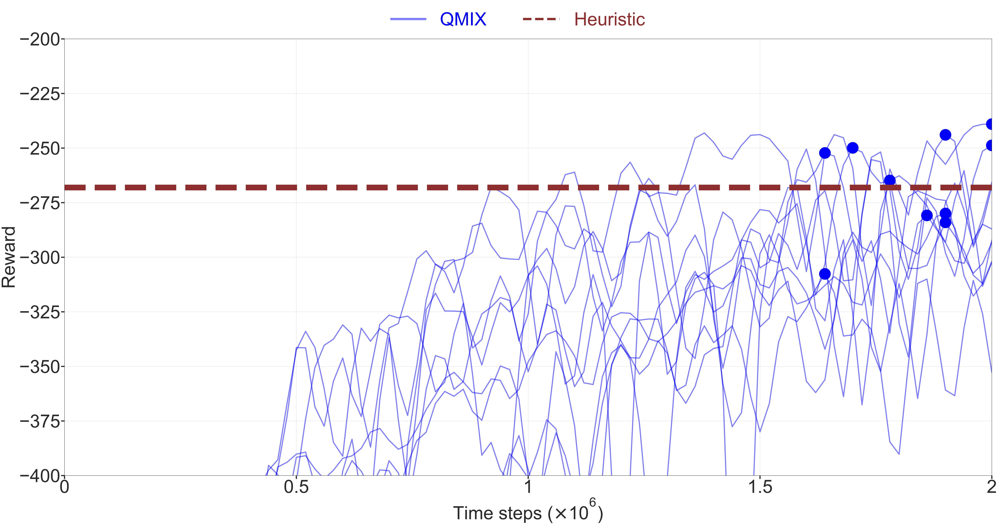]
.center.width-60[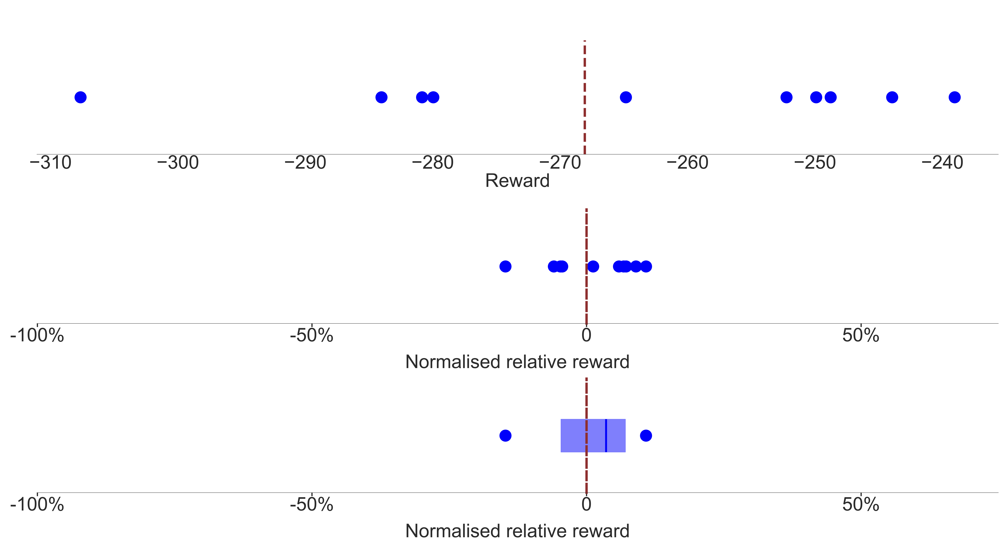]

---

# QMIX in the k-out-of-n system.

- $n$: from 3 to 100 agents.
- $H$: the score of the heuristic.

.center.width-100[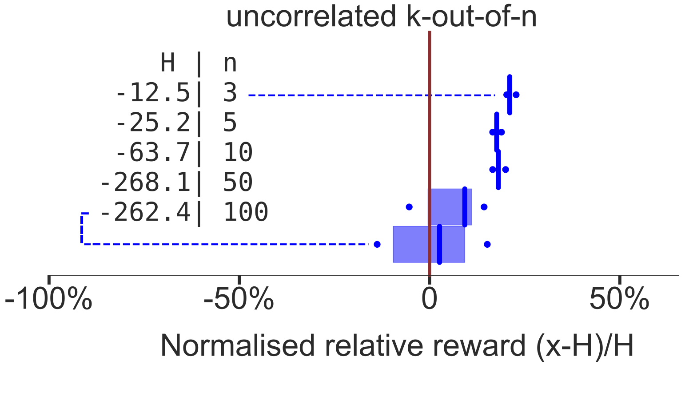]

---
.center.width-100[]
.center.width-40[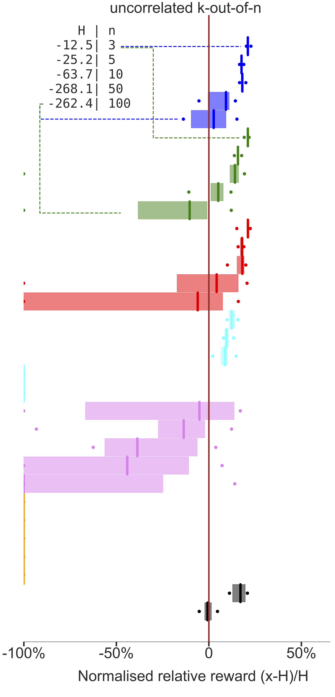]

???
Better than heuristic

Less better when n is big

huge variance with large n

independent does not work

centralised work well (but more parameter)

WHY does perf decreases when n increases?

---

# Correlated initial damage distribution

.center.width-100[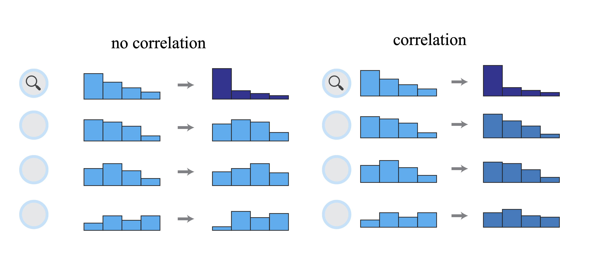]

---

# Offshore wind farm 

.center.width-100[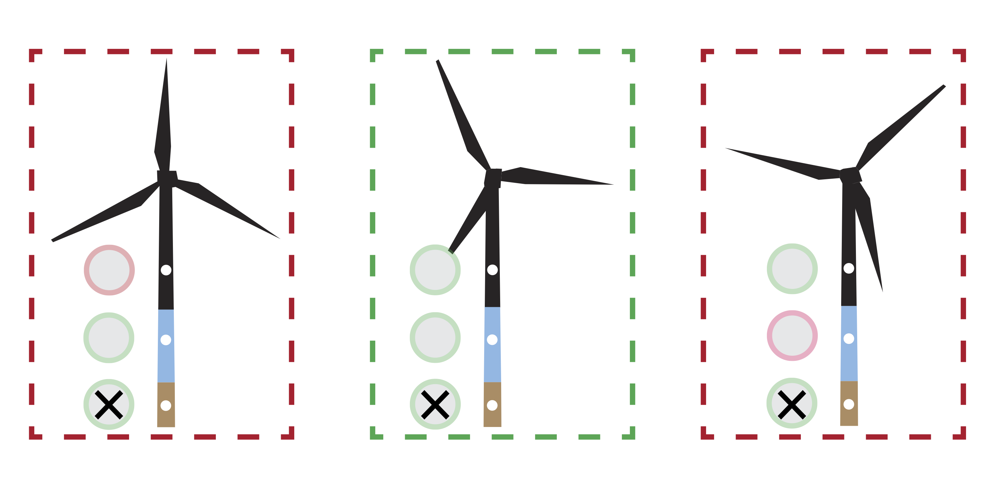]

---

# Campaign costs

.center.width-100[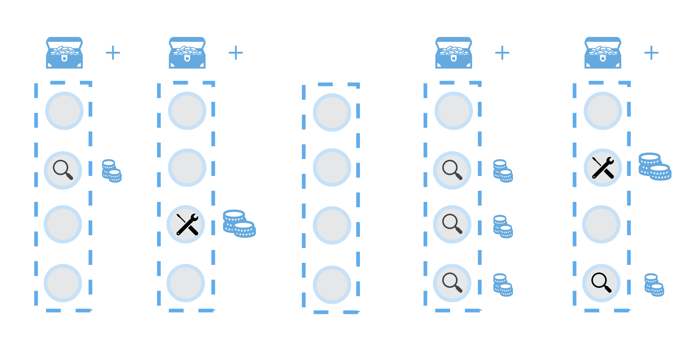]

$$ \sum\_{t=0}^{T-1} \gamma^t \left[ R\_{t,f}+ \sum\_{a=1}^n \left({R\_{t,ins}^a} + {R\_{t,rep}^a}\right)+R\_{t,camp} \right]$$

---
class: middle

.center.width-60[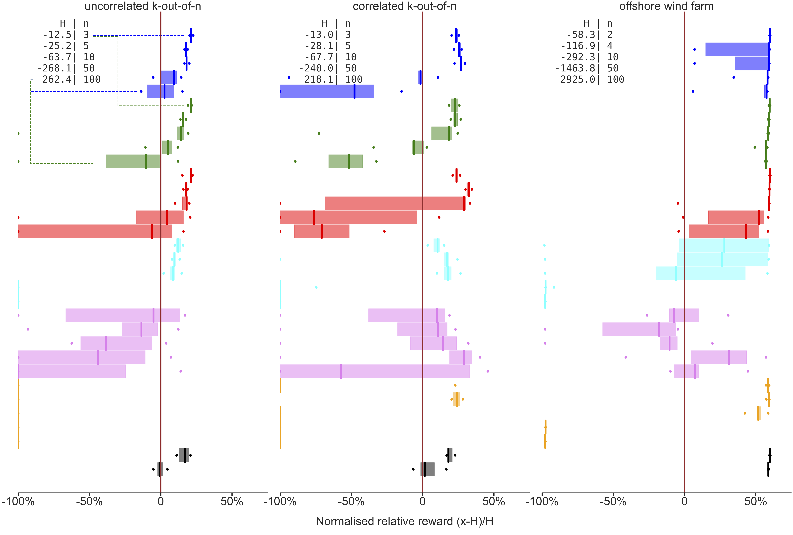]
.center.width-60[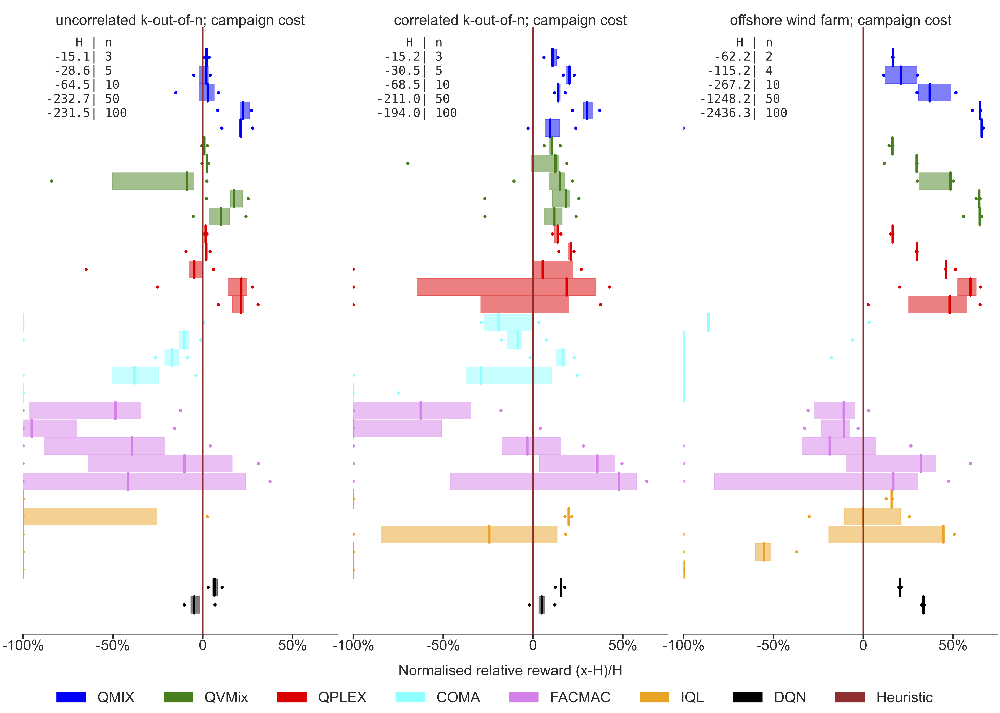]

---

# IMP-MARL

- Six new real-world environments.

- CTDE methods can perform better than the expert-based heuristic.

- IMP environments demand cooperation among agents: 
    CTDE $>>$ Decentralised.

--

- Remaining challenges:
    - Scalability.
    - Correlated distribution. 
    - Campaign costs.

---
class: section

# How to train a team to compete against others?

---
# Competition

- In a two player competition:
    - Agents need to be good against many strategies.
    - Agents should adapt!

--

- How to play chess?

Agent learns by playing against itself with MCTS - AlphaGo

--

- How to play StarCraft 2?

A population of agents play against each other to face many strategies - AlphaStar

--

.bold[*Can we use these learning scenario to train teams with CTDE methods?*]

---

class: section

# Contribution

# Value-based CTDE Methods in Symmetric Two-team Markov Game: from Cooperation to Team Competition

---
# Two team Markov game

- Two symmetric teams, same agents face each other.

- 2 rewards, one per team $r^j\_t = R^j(s\_{t+1}, s\_t, \mathbf{u\_t})$.

- The goal of each agent $a\_{i, j}$ is to maximize $\sum\_{t} \gamma^t r^{j}\_t$.

New Competitive StarCraft Multi-Agent Challenge

.center.width-50[3M]

.center.width-50[3S5Z]

---
# The empirical study

Teams are trained with CTDE methods: QMIX, QVMix and MAVEN.

--

Teams are trained with three different learning scenarios:

--

1. Against a stationary strategy (.bold[heuristic]) like in a Dec-POMDP.

--

2. .bold[Self-play], against itself, using all played transitions to train.

--

3. Within a .bold[population] of five training teams.
    - Uniform chance to play against any of the five teams.

???

TAKE YOUR TIME

---
class: middle

# Which team is the best?

.bold[GOAL:] Be good against many strategies.

Create groups of teams evaluated together.

---
# Elo score

Assign a rating $R$ to compute the probability of winning.

--

- Let $R\_A$ and $R\_B$ be the ELO scores of player A and B.
- Probabilities:

$$
    E\_A=\frac{10^{R\_A/400}}{10^{R\_A/400} + 10^{R\_B/400}}
$$

$$
    E\_B=\frac{10^{R\_B/400}}{10^{R\_A/400} + 10^{R\_B/400}}
$$

--

Update

$$
    R'\_A = R\_A + cst \* (S\_A - E\_A)
$$
- $S\_A$ is equal to $1$ for a win, $0$ for a loss and $0.5$ for a draw.

???

- $400$ is a parameter. If the Elo score of player A is 400 points above that of B, it has a ten-times greater chance of defeating B.

- New score where $cst$ is a constant that defines the maximum possible update of the Elo score (10 in our paper, typically 32).

---

First, we group teams by training method.

- .bold[H] = trained against heuristic,
- .bold[S] = self-play,
- .bold[P] = within a population,
- .bold[BP] = the 10 bests of each population.

QVMix in the 3M map:

.center.width-70[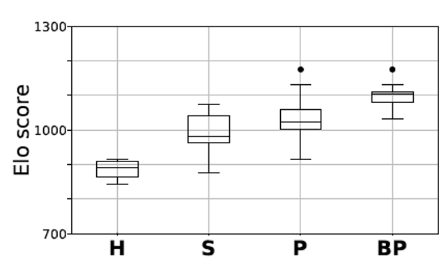]

---
class: middle

.center.width-100[]

.footnote[Leroy, P., Pisane, J., Ernst, D. (2022). Value-based CTDE Methods in Symmetric Two-team Markov Game: from Cooperation to Team Competition.]

---
class: middle

All together: same conclucion!

.center.width-80[]

.footnote[Leroy, P., Pisane, J., Ernst, D. (2022). Value-based CTDE Methods in Symmetric Two-team Markov Game: from Cooperation to Team Competition.]

---

# 3S5Z

What if the heuristic is the best?

.center.width-80[]

.footnote[Leroy, P., Pisane, J., Ernst, D. (2022). Value-based CTDE Methods in Symmetric Two-team Markov Game: from Cooperation to Team Competition.]

---

# Two-team Markov game 

- Trained teams:
    1. Against a stationary strategy,
    2. In self-play,
    3. In a population of learning teams.

- Training within a population is the best.

- Whether or not the stationary strategy is better than all.

- A selection procedure is required in the population.

---
class: section

# Conclusions

---
# Conclusions

- What is (multi-agent) reinforcement learning.

- How to train a team of agents to cooperate.

- How to train a team of agents to compete against several strategies.

--

# Reinforcement Learning is not DEAD !

BACKUP SLIDES!
