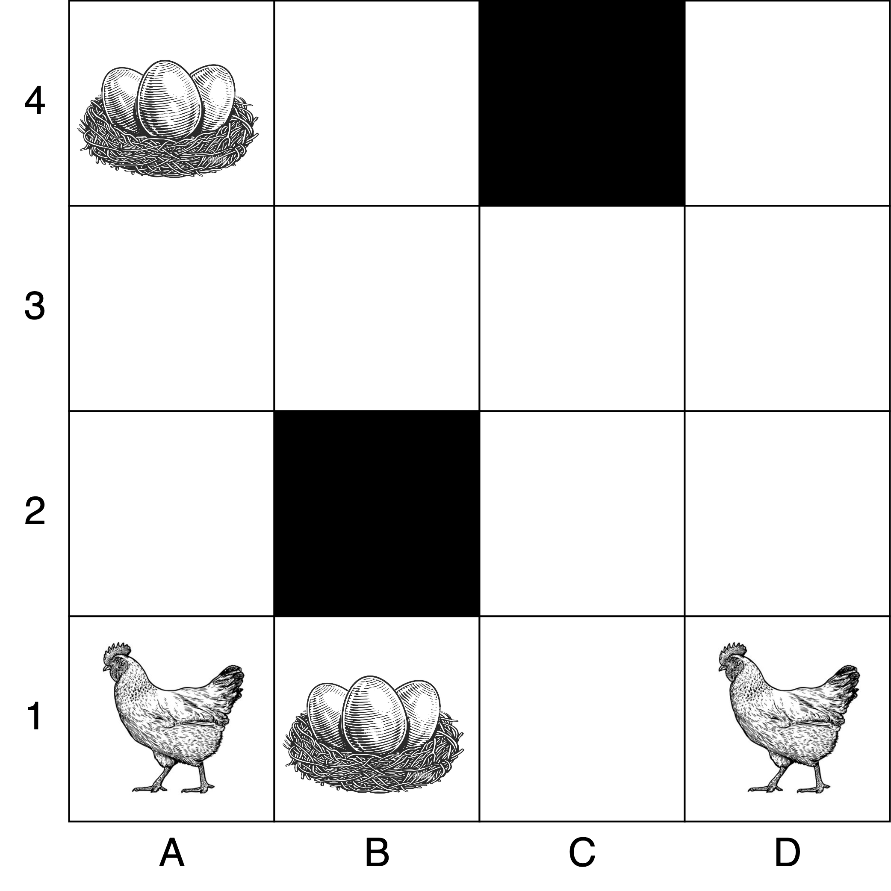
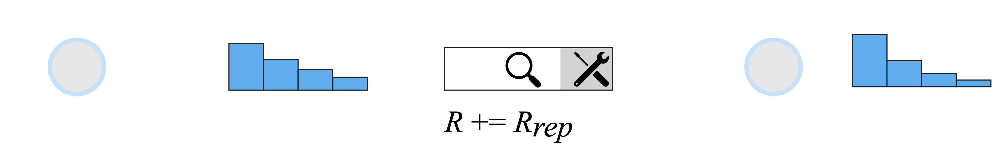

class: middle, center, title-slide
count: false

# Contributions to Multi-Agent Reinforcement Learning

PhD Defense

  

Pascal Leroy 
June 28, 2024

---
class: middle 
# Today

- Introduction to reinforcement learning.

- Multi-agent reinforcement learning.

- Contributions of the thesis:
    - Transfering reinforcement learning algorithms to the multi-agent setting.
    - Solving a real-world application with multi-agent reinforcement learning.
    - An empirical study to address new problems with these algorithms.

???

Today, I will try to explain what is reinforcement learning.

In the first part, we will start with the classical setting where a single agent learns with reinforcement learning.

Then, we will discuss what changes when several agents learn.

In the second part of the presentation, we will dive more technically in the contributions of the thesis and what is to learn to cooperate and how to cooperate in a competitive environment.

---

class: section

# Reinforcement learning

???

RL is an agent learning to take decisions to maximise rewards.

---
class: middle

.center[
<video controls preload="auto" height="500" width="700">
  <source src="./figures/chicken1.mp4" type="video/mp4">
</video>]

.footnote[Video credits: [Megan Hayes](https://twitter.com/PigMegan), [@YAWScience](https://twitter.com/YAWScience/status/1304199719036444672), 2020. Taken from [Intro to IA](https://github.com/glouppe/info8006-introduction-to-ai/) by Gilles Louppe.]

???

In this video, the agent is the chicken.

Its action is to pick a paper.

If it picks the pink one, it has a reward.

The environment is where the agent evolve.

Here, the state of the environment is the papers of different color.

---
class: middle

.center[
<video controls preload="auto" height="500" width="700">
  <source src="./figures/chicken2.mp4" type="video/mp4">
</video>]

.footnote[Video credits: [Megan Hayes](https://twitter.com/PigMegan), [@YAWScience](https://twitter.com/YAWScience/status/1304199719036444672), 2020. Taken from [Intro to IA](https://github.com/glouppe/info8006-introduction-to-ai/) by Gilles Louppe.]

???

Let us look at another example with a cone.

The chicken has to circle around it to receive a reward.

You see here, it understands that the reward is in the hand.

But it has to figure out that it needs to circle around the cone!

And even if it succeeded before, it can still fail because it is still exploring what is the best things to do.

---
class: middle

.italic[Reinforcement learning is learning what to do, how to map situations to .bold[actions], so as to .bold[maximize] a numerical .bold[reward] signal.]

.pull-right[Sutton & Barto, 1998.]  

.center[.circle.width-25[]
.circle.width-25[]]

---

class: middle

An agent is learning by .bold[interacting] in its .bold[environment] to maximise rewards.

 

.center[.width-100[]]

.footnote[R. S. Sutton and A. G. Barto. Reinforcement learning, second edition: An introduction. 2018]

???

.bold[DIRE S U et R]

To rephrase our first definition, we then say that in RL, an agent is learning by interacting in its environment to maximise a reward.

As we can see in the diagram, the environment is in a given state, given by the letter S.

The agent perceives this state and decide on an action, that we denote U.

It then receives a reward R and start over.

---
class: middle

## Chicken environment

.grid[
.kol-1-3[
.center[States $s$

Chicken locations $(i, j)$

Initial: $(A, 1)$]
]
.kol-2-3[
.center[.width-100[]]
]]

???
Let's look and example

---
class: middle

## Chicken environment

.grid[
.kol-1-3[
.center[Actions $u$

$[Left, Right, Up, Down]$]
]
.kol-2-3[
.center[.width-100[]]
]]

---
class: middle

## Chicken environment

.grid[
.kol-1-3[
.center[
Transition function

$s_{t+1} = P(s_t, u_t)$
]
]
.kol-2-3[
.center[.width-100[]]
]]

---
class: middle

## Chicken environment

.grid[
.kol-1-3[
.center[
Reward function 

$+1$ if $s_{t+1} = (D,4)$, 

$-1$ if $s_{t+1} = (D, 2)$,

$0$ otherwise
]
]
.kol-2-3[
.center[.width-100[]]
]]

---

## Optimal policy

.center[For .bold[each state] $s=(i, j)$, we want to choose the .bold[best action!]]

.center[.width-70[]]

???
Let's think for a second, what is the best action to be made in (3,4) or in (3, 1)?

---

class: middle

Easy to find an optimal policy, why do we need reinforcement learning?

.center[.width-70[]]

---
  

## What knows the agent?

1. It is in the .bold[state (A, 1)] and there are 16 states ($\mathcal{S}$),

2. It has the choice between .bold[four actions] ($\mathcal{U}$).

--
count: false

It does not know:

- Taking the third action will change the state to (A, 2),

--
count: false

- The reward arriving in (A, 2) is 0.

--
count: false

It needs to .bold[explore], by trials and errors, to learn an optimal policy.

---
class:middle, black-slide

.center.width-100[]
.center[Drone control]

.footnote[Kaufmann, E., et al. Champion-level drone racing using deep reinforcement learning, Nature, 2023]
---
class:middle, black-slide

.center[.width-90[]
Content recommendation]

.footnote[Ehtsham Elahi, et al. [Reinforcement Learning for Budget Constrained Recommendations](https://netflixtechblog.com/reinforcement-learning-for-budget-constrained-recommendations-6cbc5263a32a), 2022]

---
class:middle, black-slide

.center.width-100[]
.center[Robotics]

.footnote[Open AI, [Solving Rubik's Cube with a Robot Hand](https://arxiv.org/abs/1910.07113), 2019]

???
Provide state and action and reward intuitions.

---
 
 
     
## Wrap-up

- In RL, an agent learns by interacting in its environment to maximise rewards.

- It learns a policy that provides for all states $\forall s$ which action $u$ to take.

- It does not know the environment and needs to explore.

--
count: false

## What if the fox can move?

---
class: section

# Multi-Agent

# Reinforcement Learning

???
What changes if the fox can move and also learn?

---
class: middle

## Multi-agent environment

All agents $a\_i \in \{ 1,...,n \}$ learn a policy $\pi^{a}$ to maximise their own reward $r_t^{a\_i}$.

.center[.width-100[]]

???
We still have the transition

---
class: middle, red-slide

.center.Huge[Rewards depend on actions of all agents]

---

## Competition

The fox learns to catch the chicken.

.center[.width-70[]]

---

## Cooperation

Two chickens and two nests.

.center[.width-70[]]

---
## General-sum

Two chickens, one fox and one donkey.

.center[.width-70[]]

---
class: section

# Reinforcement learning algorithms

---
class: middle

## Markov Decision Process (MDP)

Transition function defines a probability to reach $s\_{t+1} \sim P(s\_{t+1}|s\_t, u\_t)$.

.center[.width-100[]]

???
DONT Talk about the markov property.

---
class: middle

## Goal

The agent learns the .bold[policy] $\pi$ mapping each state $s$ to an action $u$ to .bold[maximise]

$$\mathbb{E}_{\pi} \left[ \sum_t \gamma^t r_t | s_t \right] \forall s_t.$$

The discount factor $\gamma \in [0, 1]$ can encourage immediate rewards.

???

How can I know which is the best action?

---
  

## Policy evaluation

What is the expected sum of discounted rewards from $s$ following $\pi$?

--
count: false

$$\mathbb{E}\_{\pi} [ r\_t + \gamma r\_{t+1} + \gamma^2 r\_{t+2} + \gamma^3 r\_{t+3} + \gamma^4 r\_{t+4}+... | s\_t = s]$$

--
count: false

This is the .bold[state value function] $V$

$$ V^{\pi}(s)= \mathbb{E}_{\pi} \left[ \sum_t \gamma^t r_t | s\_t = s \right].$$ 

--
count: false

An .bold[optimal policy] $\pi^\*$ satisfies

$$ V^{\pi^\*}(s) = \max\_\pi V^{\pi}(s).$$

???

.bold[IF WE HAVE two policies]
.bold[What is we can directly compare actions?]

---

  

## State-action value function

From $s$, taking $u$, what is the expected sum of discounted rewards following $\pi$?

--
count: false

$$ Q^\pi(s, u) = \mathbb{E}\_{\pi}\left[r\_t + \gamma V^{\pi}(s\_{t+1})|s\_t=s, u\_t = u\right]$$

--
count: false

Bellman optimality equation:

$$  Q(s, u) = \mathbb{E}\_{\pi^\*}[r\_t + \gamma \max\_{u'} Q(s\_{t+1}, u') |s\_t=s, u\_t=u].$$

--
count: false

The optimal deterministic policy is

$$ \pi^\*(s) = \arg\max\_u Q(s, u).$$

---

   

## Deep Q-Network (DQN)

.footnote[Volodymyr Mnih, et al. Playing Atari with Deep Reinforcement Learning, 2013.]

Learn the optimal $Q$ with a neural network of parameters $\theta$.

--
count:false

Update by minimising

$$
\mathcal{L}(\theta) = \mathbb{E}\_{\langle s\_{t},u\_{t},r\_{t},s\_{t+1} \rangle} \big(r\_{t} + \gamma  \underset{u }{\max} Q(s\_{t+1}, u; \theta') - Q(s\_{t}, u\_{t}; \theta)\big)^2$$

--
count:false

Transitions obtained by exploring an $\epsilon$-greedy policy.

???
- The replay buffer $B$ is a collection of transitions.
- Sampling transitions allows to update the network.
- $\theta'$ are the parameters of the target network, a copy of $\theta$ periodically updated.
- To play Atari games:
    - $\theta$ is a CNN.
- When the environment is partially observable (POMDP):
    - $\theta$ is a recurrent network (DRQN).
    - $B$ stores sequences of transitions.

---
class: middle

## Partially-observable Markov Decision Process (POMDP).

The policy is $\pi(u|\tau)$ where $\tau$ is the history of past observations and actions.

.center[.width-85[]]

???

Oralement RNN 

---

   

## Wrap-up:

- Agent learns to .bold[maximise] $\mathbb{E}_{\pi} \left[ \sum_t \gamma^t r_t | s_t \right] \forall s\_t$.

- $Q(s\_t, u\_t)$ is the best $\mathbb{E}_{\pi} \left[ \sum_t \gamma^t r_t | s_t, u_t\right]$.

- $ \pi^\*(s\_t) = \arg\max\_u Q(s\_t, u) $.

- Deep Q-Network (DQN) is learning $Q(s\_t, u\_t)$ with a neural network.

- If the environment is partially observable, decisions are based on the history $\tau$.

---
class: section

# Learning to cooperate with reinforcement learning

???

- Train a team to cooperate
- Contributions

---
class: middle 

## Decentralised Partially Observable Markov Decision Process (Dec-POMDP)

A single reward for all agents

$$
r^{a\_1}\_t = r^{a\_n}\_t=r\_t.
$$

.center.width-85[]

---
class: middle, black-slide

.center.width-85[]
.center[Robotic warehouses.]

.footnote[Georgios Papoudakis et al. Benchmarking Multi-Agent Deep Reinforcement Learning Algorithms in Cooperative Tasks, 2021.]

---
class: middle, black-slide

.center.width-65[]
.center[Multi-Agent Tracking.]
.footnote[Xuehai Pan, et al. MATE: Benchmarking Multi-Agent Reinforcement Learning in Distributed Target Coverage Control, 2022.]

---
class: middle, black-slide

## StarCraft Multi-Agent Challenge (SMAC)

3M
.center.width-75[]

3S5Z
.center.width-75[]

.footnote[Samvelyan, et al. [The starcraft multi-agent challenge.](https://github.com/oxwhirl/smac), 2019.]

???
We do not play Starcraft!

More details on the setting

---
class: middle, black-slide

.center.width-75[]
.center[SMAC observation and attack ranges.]

.footnote[Samvelyan, et al. [The starcraft multi-agent challenge.](https://github.com/oxwhirl/smac), 2019.]

---
class: middle

# How to control agents?

---

    
## Centralised controller

--
count: false

One agent learn $Q(s_t, \mathbf{u\_t})$ where $\mathbf{u\_t} = (u^1_t,..,u^n_t)$.

--
count: false

.bold[Problems]

- $|\mathcal{U}\_1 \times ... \times \mathcal{U}\_n|$,

- Partial observability?

???

More on partial observability.

---
    

##  Decentralised controller

Each agent learns independently $Q\_a(\tau^a\_t, u^a\_t)$.

--
count:false

.bold[Problems]

- Non-stationarity,

- Credit assignment.

---
  

## Centralised training with decentralised execution (CTDE)

During training:

- Training in simulator,

- We have access to $s$ and $\mathbf{u\_t}$,

- It is possible to learn $Q(s\_t, \mathbf{u\_t})$.

--
count: false

At execution:

- Only $\tau^a\_t$ are available,

- It is .bold[NOT] possible to use $Q(s\_t, \mathbf{u\_t})$ during execution.

---
 

## CTDE Value-based methods

Only $Q\_a(\tau^a\_t, u^a\_t)$ are available during the execution.

--
count: false

.bold[Goal]: $ \forall a: \underset{u^a\_t}{\arg\max} Q\_a(\tau^a\_t, u^a\_t)$ maximise $Q(s\_t, \mathbf{u\_t}). $

--

## Individual Global Max

$$
\underset{\mathbf{u\_t}}{\arg\max} Q(s\_t, \mathbf{u\_t}) 
=
\begin{pmatrix}
\underset{u^{a\_1}\_t}{\arg\max} Q\_1(\tau^{a\_1}\_t, u^{a\_1}\_t)\\\\
.\\\\
.\\\\
.\\\\
\underset{u^{a\_n}\_t}{\arg\max} Q\_n(\tau^{a\_n}\_t, u^{a\_n}\_t) 
\end{pmatrix}
$$

---

  

## Individual Global Max

$ \underset{u^a\_t}{\arg\max} Q\_a(\tau^a\_t, u^a\_t)$ maximises $Q(s\_t, \mathbf{u\_t}). $

--
count: false

.bold[Solution]:

- Use $Q\_a(\tau^a\_t, u^a\_t)$ to select actions,

- learn $Q(s\_t, \mathbf{u\_t})$ as a function of all $Q\_a(\tau^a\_t, u^a\_t)$ during training.

--
count: false

- Follow the Deep Q-Network algorithm
$$
    \mathcal{L}(\theta) = \mathbb{E}\_{ \langle . \rangle  }
    \bigg[  \big(r\_{t} + \gamma \underset{\mathbf{u}}{\max} Q(s\_{t+1}, \mathbf{u}; \theta') - Q(s\_{t}, \mathbf{u\_{t}}; \theta)\big)^{2} \bigg]
$$

???

Question: How to satisfy IGM?

---
## QMIX

Non-linear factorisation of $Q(s\_t, \mathbf{u\_t})$ with monotonicity.

.footnote[Rashid, T., et al. QMIX: Monotonic value function factorisation for deep multi-agent reinforcement learning, 2018.]

--
count: false

$$
    \frac{\partial Q(s\_t, \mathbf{u\_t})}{\partial Q\_{a}(\tau^{a}\_t, u\_t^{a})} \geq 0 \text{ } \forall a
$$

--
count: false

.center.width-50[]

---
class: middle

## Are there better methods than Deep Q-Network to learn $Q(s, u)$?

---
 
## Deep Quality-Value

.footnote[M. Sabatelli, et al. Deep quality-value (DQV) learning, 2018.]

Deep Q-Network:
$$
    \mathcal{L}(\theta) = \mathbb{E}\_{\langle s\_{t},u\_{t},r\_{t},s\_{t+1}\rangle }
    \bigg[ \big(r\_{t} + \gamma \max\_{u } Q(s\_{t+1}, u; \theta') - Q(s\_{t}, u\_{t}; \theta)\big)^{2}\bigg].
$$

--
count:false

Motivation&#58;

$$ V(s\_{t+1}) =\max\_{u} Q(s\_{t+1}, u; \theta').$$

--
count:false

Learn $Q(.;\theta)$ and $V(.;\phi)$ at the same time.

$$
\mathcal{L}(\theta) = \mathbb{E}\_{\langle s\_t,u\_t,r\_t,s\_{t+1}\rangle} \bigg[ \big(r\_t + \gamma V(s\_{t+1}; \phi') - Q(s\_t, u\_t; \theta) \big)^{2} \bigg],
$$

--

$$
\mathcal{L}(\phi) = \mathbb{E}\_{\langle  s\_{t},u\_{t},r\_{t},s\_{t+1}  \rangle} \bigg[\big(r\_{t} + \gamma V(s\_{t+1}; \phi') - V(s\_{t}; \phi)\big)^{2}\bigg].
$$

--
count: false

---

.center.width-100[]

---
class: middle

## Motivation

- Deep Quality-Value outperform Deep Q-Network.

- Can we improve QMIX by learning both $Q$ and $V$?

---
class: middle

## QVMix

Take the architecture of $Q$ in QMIX to compute both $Q$ and $V$. 

$$
    \mathcal{L}(\theta) = \mathbb{E}\_{\langle s\_{t},\mathbf{u\_{t}},r\_{t},s\_{t+1}\rangle}
    \bigg[\big(r\_{t} + \gamma V(s\_{t+1}; \phi') - Q(s\_{t}, \mathbf{u\_{t}}; \theta)\big)^{2}\bigg]
$$
$$
    \mathcal{L}(\phi) = \mathbb{E}\_{\langle s\_{t},\mathbf{u\_{t}},r\_{t},s\_{t+1}\rangle} 
    \bigg[\big(r\_{t} + \gamma V(s\_{t+1}; \phi') - V(s\_{t}; \phi)\big)^{2}\bigg]
$$

.center.width-40[]

---
class: middle

## Experiments

- In 3M, all methods work.

- In 3S5Z:
    - Indepedent methods struggle,
    - QVMix can outperform other CTDE methods.

.grid[
.kol-1-2[
.center.width-100[3M]
]
.kol-1-2[
.center.width-100[3S5Z]
]]
.center.width-100[]

.footnote[Leroy, P., et al. QVMix and QVMix-Max: Extending the Deep Quality-Value Family of Algorithms to Cooperative Multi-Agent Reinforcement Learning, 2020.]

---
class: middle

## Overestimation bias

.center.width-80[]
.center.width-100[]

.footnote[Leroy, P., et al. QVMix and QVMix-Max: Extending the Deep Quality-Value Family of Algorithms to Cooperative Multi-Agent Reinforcement Learning, 2020.]

---
class: middle

## QVMix

- New value-based methods for Dec-POMDP.

- Learning $V$ as a target for learning $Q$.

- Indepent learner: .bold[IQV] and .bold[IQV-Max].

- CTDE: .bold[QVMix] and .bold[QVMix-Max].

- QVMix achieves similar and sometimes better performance than QMIX.

- Reduce the overestimation bias.

---

.center.width-100[]

---
class: middle
## Motivation

Common benchmarks are .red[games] or .red[simulators].

Only .red[few real-world] environments and .red[few large-scale] environments.

.bold[Infrastructure management planning]
- An impactful .green[real-world ] application.
- Allows .green[large-scale] environments.
- Need more .green[open-source contributions].

---

class: middle

## Infrastructure management planning

- Maintain a system composed of different components.
    - Bridges
    - Wind farms

- Decide which component needs to be inspected or repaired.

- Tradeoff between reducing maintenance costs and failure risks.

- Today, solved with expert-based heuristic.

---
class: middle

## A k-out-of-n system

Fail if less than k-out-of-n components are opertionnal.

.center.width-100[]
.center[A 4-out-of-5 system.]

.footnote[P Leroy, PG Morato, et al. IMP-MARL: a suite of environments for large-scale infrastructure management planning via MARL, 2023.]

---
class: middle

## A component

In our work, probability on a crack size.

.center.width-50[]

.footnote[P Leroy, PG Morato, et al. IMP-MARL: a suite of environments for large-scale infrastructure management planning via MARL, 2023.]

???

VALEURS DE BIN

---

## Possible decisions

.footnote[P Leroy, PG Morato, et al. IMP-MARL: a suite of environments for large-scale infrastructure management planning via MARL, 2023.]

.center.width-100[]

--
count: false

.center.width-100[]

--
count: false

.center.width-100[]

--
count: false

.center.width-100[]

---
class: middle

## The failure risk of the system

.center.width-50[]

.footnote[P Leroy, PG Morato, et al. IMP-MARL: a suite of environments for large-scale infrastructure management planning via MARL, 2023.]

---
class: middle

## Infrastructure management planning

.center.width-100[]

.footnote[P Leroy, PG Morato, et al. IMP-MARL: a suite of environments for large-scale infrastructure management planning via MARL, 2023.]

???

- State and observations:
    - Probability on the deterioration state of each part.

- Actions: 

    1. Do-nothing
    2. Inspect
    3. Replace/repair

- Maximise the reward:

$$ \sum\_{t=0}^{T-1} \gamma^t \left[ R\_{t,f}+ \sum\_{a=1}^n \left({R\_{t,ins}^a} + {R\_{t,rep}^a}\right) \right]$$

- Failure cost is $R\_f = c\_F \times p\_{Fsys}$.

encompassing economic, environmental, and societal losses

---
class:middle

## How to solve with (MA)RL?

- One agent decides for one component of the system.

- They all cooperate to maximise

$$ \sum\_{t=0}^{T-1} \gamma^t \left[ R\_{t,f}+ \sum\_{a=1}^n \left({R\_{t,ins}^a} + {R\_{t,rep}^a}\right)  \right]$$

- Failure cost is $R\_f = c\_F \times p\_{Fsys}$.

- .bold[GOAL]: Can (MA)RL be better than the heuristic?

---

## How much better than the heuristic?

Normalised boxplot against the expert rule-based heuristic policy.

.center.width-60[]

.center.width-60[]

---
class:middle
## QMIX in the k-out-of-n system.

- $n$: from 3 to 100 agents.
- $H$: the score of the heuristic.

.center.width-100[]

---
.center.width-100[]
.center.width-40[]

???

Better than heuristic

Less better when n is big

huge variance with large n

independent does not work

centralised work well (but more parameter)

WHY does perf decreases when n increases?

---
class: middle
## Correlated initial damage distribution

One inspection provides information about all components.

.center.width-100[]

---
class: middle
## Offshore wind farm 

A wind turbine is composed of three components, only two are maintenable.

.center.width-100[]

---
class: middle
## Campaign costs

Additional cost to group inspections and repairs.

$$ \sum\_{t=0}^{T-1} \gamma^t \left[ R\_{t,f}+ \sum\_{a=1}^n \left({R\_{t,ins}^a} + {R\_{t,rep}^a}\right)+R\_{t,camp} \right]$$

.center.width-100[]
.center.width-60[]

---
class: middle

.center.width-60[]
.center.width-60[]

---
class: middle

## IMP-MARL

- Six new open-source real-world environments.

- CTDE methods can perform better than the expert-based heuristic.

- Infrastructure management planning demands cooperation among agents.

- Remaining challenges:
    - Scalability.
    - Correlated distribution. 
    - Campaign costs.

---
class: section

# How to train a team to compete against many strategies?

---
 

## Competition

- Agents need to be good against many strategies.
- Agents should adapt!

--
count: false

- How to play Chess?

AlphaGo: One agent learns by playing against itself with Monte Carlo Tree Search.

--
count: false

- How to play StarCraft 2?

AlphaStar: A population of agents play against each other to face many strategies.

--
count: false

.bold[*Can we use these learning scenario to train teams with CTDE methods?*]

???
ROCK PAPER SCISSOR

---
class:middle

.center.width-100[]

---
class: middle

## Motivation

- We want to train teams to be resilient against many strategies.

- Works in 1v1 competition:
    - Train with single-agent reinforcement learning,
    - Learning scenarios: train against different opponents.

- Combine these approaches with CTDE methods.
    - Amongst the first ones!

---
class: middle
## Two team Markov game

- Two teams.

- Teams are symetric, same agents face each other.

- 2 rewards, one per team $r^j\_t = R^j(s\_{t+1}, s\_t, \mathbf{u\_t})$.

- The goal of each agent $a\_{i, j}$ is to maximize $\sum\_{t} \gamma^t r^{j}\_t$.

---
class: middle, black-slide

## New Competitive StarCraft Multi-Agent Challenge

3M
.center.width-75[]

3S5Z
.center.width-75[]

.footnote[Leroy, P., et al. Value-based CTDE Methods in Symmetric Two-team Markov Game: from Cooperation to Team Competition, 2022.]

---
 

## The empirical study

Teams are trained with .bold[CTDE methods]:
1. .bold[QMIX],
1. .bold[QVMix],
1. .bold[MAVEN].

--
count: false

Teams are trained with three different .bold[learning scenarios]:

--
count: false

1. Against a stationary strategy (.bold[heuristic]) like in a Dec-POMDP.

--

2. .bold[Self-play], against itself, using all played transitions to train.

--

3. Within a .bold[population] of five training teams.
    - Uniform chance to play against any of the five teams.

???

TAKE YOUR TIME

---
class: middle

## Which team is the best?

Evaluate teams against many strategies in groups.

---
  
## Elo score

Compute the probability of winning between two individuals.

--
count: false

- Let $R\_A$ and $R\_B$ be the ELO scores of A and B.

$$
    E\_A=\frac{10^{R\_A/400}}{10^{R\_A/400} + 10^{R\_B/400}} \text{ and } E\_B=\frac{10^{R\_B/400}}{10^{R\_A/400} + 10^{R\_B/400}}
$$

--
count: false

- If $R_A = 1200$ and $R_B=800$,  $E_A = 10^3/(10^3+10^2) = 10 / 11$.

--
count: false

Update

$$
    R'\_A = R\_A + 10 \* (S\_A - E\_A)
$$

- $S\_A$ is equal to $1$ for a win, $0$ for a loss and $0.5$ for a draw.

???

- $400$ is a parameter. If the Elo score of player A is 400 points above that of B, it has a ten-times greater chance of defeating B.

- New score where $cst$ is a constant that defines the maximum possible update of the Elo score (10 in our paper, typically 32).

---
class: middle

Group teams by training method.

- .bold[H] = trained against heuristic,
- .bold[S] = self-play,
- .bold[P] = within a population,
- .bold[BP] = the 10 bests of each population.

.center.width-70[]
.center[QVMix in the 3M map.]

.footnote[Leroy, P., et al. Value-based CTDE Methods in Symmetric Two-team Markov Game: from Cooperation to Team Competition, 2022.]

---

## The heuristic in the evaluation group

.center.width-60[]
.center.width-60[]
.center[QVMix in the 3M map.]

.footnote[Leroy, P., et al. Value-based CTDE Methods in Symmetric Two-team Markov Game: from Cooperation to Team Competition, 2022.]

---
class: middle

.center.width-100[]
.center[All methods in the 3M map.]

.footnote[Leroy, P., et al. Value-based CTDE Methods in Symmetric Two-team Markov Game: from Cooperation to Team Competition, 2022.]

---
class: middle

.center.width-100[]
.center[All methods in one evaluation group in the 3M map.]

.footnote[Leroy, P., et al. Value-based CTDE Methods in Symmetric Two-team Markov Game: from Cooperation to Team Competition, 2022.]

---
class: middle

## The heuristic is the best in the 3S5Z map.

.center.width-100[]
.center[All methods in one evaluation group in the 3S5Z map.]

.footnote[Leroy, P., et al. Value-based CTDE Methods in Symmetric Two-team Markov Game: from Cooperation to Team Competition, 2022.]

---
class: middle

## Two-team Markov game 

- Trained teams:
    1. Against a stationary strategy,
    2. In self-play,
    3. In a population of learning teams.

- Training within a population is the best.

- Whether or not the stationary strategy is better than all.

- A selection procedure is required in the population.

---
class: section

# Conclusions

---
# Today

- What is (multi-agent) reinforcement learning.

--

- How to train a team of agents to cooperate:
    - Centralised training with decentralised execution.
    - QVMix can be better than QMIX.
    - Infrastructure management planning, a real-world application.

--

- How to train a team of agents to compete against many strategies:
    - Train it within a population of learning teams.

--
count: false

# Reinforcement learning can solve real-world problems!

---

---

---

## QVMix and QVMix-Max

Take the architecture of $Q$ in QMIX to compute both $Q$ and $V$. 

.bold[QVMix:]

$$
    \mathcal{L}(\theta) = \mathbb{E}\_{\langle . \rangle }
    \bigg[\big(r\_{t} + \gamma V(s\_{t+1}; \phi') - Q(s\_{t}, \mathbf{u\_{t}}; \theta)\big)^{2}\bigg]
$$
$$
    \mathcal{L}(\phi) = \mathbb{E}\_{\langle . \rangle} 
    \bigg[\big(r\_{t} + \gamma V(s\_{t+1}; \phi') - V(s\_{t}; \phi)\big)^{2}\bigg]
$$

.bold[QVMix-Max:]

$$
    \mathcal{L}(\phi) = \mathbb{E}\_{\langle . \rangle} 
    \bigg[\big(r\_{t} + \gamma \max\_{\mathbf{u} } Q(s\_{t+1}, \mathbf{u}; \theta') - V(s\_{t}; \phi)\big)^{2}\bigg]
$$

---

## QVMix and QVMix-Max results

.center.width-60[]

---
## IMP-MARL model

$$
d\_{t+1} =\bigg[ \Big(1-\frac{m}{2}\Big) C\_{FM}S\_{R}^m\pi ^{m/2}n\_{S} + d\_t^{1-m/2}\bigg] ^{2/(2-m)}   ,
$$

---
class: middle

## IMP-MARL
.center.width-100[]

---
class: middle

## IMP-MARL
.center.width-100[]

---
class: middle

## Two-Team 3M
.center.width-100[]
.center.width-100[]
.center[QVMix - MAVEN - QMIX]

---
class: middle

## Two-Team 3S5Z

.center.width-100[]
.center.width-100[]
.center[QVMix - MAVEN - QMIX]
